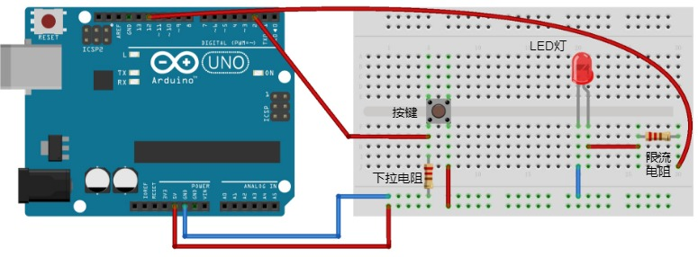
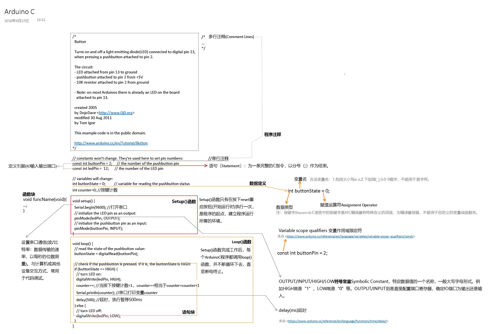

# 03_ArduinoC概述与数据类型
C是一种通用的编程语言，广泛用于系统软件与应用软件的开发。于1969年至1973年间，为了移植与开发UNIX操作系统，由丹尼斯·里奇与肯·汤普逊，以B语言为基础，在贝尔实验室设计、开发出来。

C语言具有高效、灵活、功能丰富、表达力强和较高的可移植性等特点，在程序员中备受青睐，成为最近25年使用最为广泛的编程语言[2]。目前，C语言编译器普遍存在于各种不同的操作系统中，例如Microsoft Windows、macOS、Linux、Unix等。C语言的设计影响了众多后来的编程语言，例如C++、Objective-C、Java、C#等。

二十世纪八十年代，为了避免各开发厂商用的C语言语法产生差异，由美国国家标准局（American National Standard Institute）为C语言订定了一套完整的国际标准语法，称为ANSI C，作为C语言的标准。二十世纪八十年代至今的有关程序开发工具，一般都支持匹配ANSI C的语法。

C语言设计目标是提供一种能以简易的方式编译、处理低级存储器、产生少量的机器码以及不需要任何运行环境支持便能运行的编程语言。C语言也很适合搭配汇编语言来使用。尽管C语言提供许多低级处理的功能，但仍保持良好跨平台的特性，以一个标准规格写出的C语言程序可在许多电脑平台上进行编译，甚至包含一些嵌入式处理器（微控制器或称MCU）以及超级电脑等作业平台。

(引自[wiki-C语言](https://zh.wikipedia.org/wiki/C%E8%AF%AD%E8%A8%80):https://zh.wikipedia.org/wiki/C%E8%AF%AD%E8%A8%80)

**Arduino C是C的子集。**
## 通过一个实验程序理解C语言基本结构
### 实验程序
```C
/*
  Button

  Turns on and off a light emitting diode(LED) connected to digital pin 13,
  when pressing a pushbutton attached to pin 2.

  The circuit:
  - LED attached from pin 13 to ground
  - pushbutton attached to pin 2 from +5V
  - 10K resistor attached to pin 2 from ground

  - Note: on most Arduinos there is already an LED on the board
    attached to pin 13.

  created 2005
  by DojoDave <http://www.0j0.org>
  modified 30 Aug 2011
  by Tom Igoe

  This example code is in the public domain.

  http://www.arduino.cc/en/Tutorial/Button
*/

// constants won't change. They're used here to set pin numbers:
const int buttonPin = 2;     // the number of the pushbutton pin
const int ledPin =  12;      // the number of the LED pin

// variables will change:
int buttonState = 0;         // variable for reading the pushbutton status
int counter=0; //按键计数

void setup() {
  Serial.begin(9600); //打开串口
  // initialize the LED pin as an output:
  pinMode(ledPin, OUTPUT);
  // initialize the pushbutton pin as an input:
  pinMode(buttonPin, INPUT);  
}

void loop() {
  // read the state of the pushbutton value:
  buttonState = digitalRead(buttonPin);

  // check if the pushbutton is pressed. If it is, the buttonState is HIGH:
  if (buttonState == HIGH) {
    // turn LED on:
    digitalWrite(ledPin, HIGH);
    counter++; //当按下按键计数+1，counter++相当于counter=counter+1
    Serial.println(counter); //串口打印变量counter   
    delay(500); //延迟
  } else {
    // turn LED off:
    digitalWrite(ledPin, LOW);
  }
}
```
### 电路图(基于fritzing)



### Arduino C语言基本结构概述

**通过该实验程序应该获知的知识内容：**
1. 程序注释：/*...*/,//
2. 语句块： {...;}，左大括号开始，右大括号结束
3. 函数块:返回值类型 函数名（参数名）{...;}
4. setup()与loop()函数
5. 数据定义(定义变量):"="赋值运算符
6. 符号常量
7. 串口通信：Serial.begin(波特率)，Serial.print(),Serial.println()
8. 表达式：操作符Operands+运算符Operators

**运算符优先级**
| 优先级 | 运算符 
| --- | --- | 
| 1 | *，/，% | 
| 2 | +，- | 

> 注：true为非0值；false为0值。
> 好的变量名和函数名非常重要，尽量反应所定义对象的含义内容，常规：myFunciton/my_function。

## Arduino C数据类型
Arduino C支持大多数ANSI C数据类型。变量实际上就是内存中的一片区域，只是具有一个名称。根据数据类型，直接决定为这个变量分配多少字节的内存空间，以及何种类型的数据剋存储于该变量中。注意C语言中与python的不同之处，python不需自行定义变量类型。

### Arduino C的值数据类型[Data Types](https://www.arduino.cc/reference/en/)**
| 类型 | 字节长度 | 值范围 |
| --- | --- | --- |
| boolean | 1 | 仅限于逻辑true和false |
| char | 1 | -128~+127 |
| unsigned char | 1 | 0~255 |
| byte | 1 | 0~255 |
| int | 2 | -32 768~32 768 |
| unsigned int | 2 | 0~65 535 |
| word | 2 | 0~ 65 535 |
| long | 4 | -2 147 483 648~ 147 483 648|
| unsigned long | 4 | 0 ~ 4 294 967 295|
| float | 4 | -3.0428235E+38 ~3.0428235W+38|
| double | 4 | -3.0428235E+38 ~3.0428235W+38 |
| string | ? | 以"\0" 结束|
| String | ?| 由字符数组构建的数据类型，以空字符("\0")结束 |
| void | 0 | 以变量名引用的某类型数据序列 |

### 存储器常用单位


> 二进制每左移一位，相当于原数乘以了2；每右移一位，相当于原数除以了2。位移只能用于整形数据。
### boolean数据类型
true(0)/false(非0)，例如存储开关的状态。
### char数据类型
存储8bit字符，含无符号和有符号。
[ascii table](https://www.asciitable.com/)  [wiki ascii](https://zh.wikipedia.org/wiki/ASCII)


ASCII（发音： /ˈæski/ ass-kee[1]，American Standard Code for Information Interchange，美国信息交换标准代码）是基于拉丁字母的一套电脑编码系统。它主要用于显示现代英语，而其扩展版本EASCII则可以部分支持其他西欧语言，并等同于国际标准ISO/IEC 646。

ASCII第一次以规范标准的类型发表是在1967年，最后一次更新则是在1986年，至今为止共定义了128个字符；其中33个字符无法显示（一些终端提供了扩展，使得这些字符可显示为诸如笑脸、扑克牌花式等8-bit符号），且这33个字符多数都已是陈废的控制字符。控制字符的用途主要是用来操控已经处理过的文字。在33个字符之外的是95个可显示的字符。用键盘敲下空白键所产生的空白字符也算1个可显示字符（显示为空白）。

[Unicode wiki](https://zh.wikipedia.org/wiki/Unicode)

Unicode（中文：万国码、国际码、统一码、单一码）是计算机科学领域里的一项业界标准。它对世界上大部分的文字系统进行了整理、编码，使得电脑可以用更为简单的方式来呈现和处理文字。

Unicode伴随着通用字符集的标准而发展，同时也以书本的形式[1]对外发表。Unicode至今仍在不断增修，每个新版本都加入更多新的字符。目前最新的版本为2017年6月20日公布的10.0.0[2]，已经收录超过十万个字符（第十万个字符在2005年获采纳）。Unicode涵盖的数据除了视觉上的字形、编码方法、标准的字符编码外，还包含了字符特性，如大小写字母。

Unicode发展由非营利机构统一码联盟负责，该机构致力于让Unicode方案取代既有的字符编码方案。因为既有的方案往往空间非常有限，亦不适用于多语环境。

Unicode备受认可，并广泛地应用于电脑软件的国际化与本地化过程。有很多新科技，如可扩展置标语言（Extensible Markup Language，简称：XML）、Java编程语言以及现代的操作系统，都采用Unicode编码。

**Arduino C生成ASCII字符表**
>arduino 案例自带 ASCIITable
```C
/*
  ASCII table

  Prints out byte values in all possible formats:
  - as raw binary values
  - as ASCII-encoded decimal, hex, octal, and binary values

  For more on ASCII, see http://www.asciitable.com and http://en.wikipedia.org/wiki/ASCII

  The circuit: No external hardware needed.

  created 2006
  by Nicholas Zambetti <http://www.zambetti.com>
  modified 9 Apr 2012
  by Tom Igoe

  This example code is in the public domain.

  http://www.arduino.cc/en/Tutorial/ASCIITable
*/

void setup() {
  //Initialize serial and wait for port to open:
  Serial.begin(9600);
  while (!Serial) {
    ; // wait for serial port to connect. Needed for native USB port only
  }

  // prints title with ending line break
  Serial.println("ASCII Table ~ Character Map");
}

// first visible ASCIIcharacter '!' is number 33:
int thisByte = 33;
// you can also write ASCII characters in single quotes.
// for example, '!' is the same as 33, so you could also use this:
// int thisByte = '!';

void loop() {
  // prints value unaltered, i.e. the raw binary version of the byte.
  // The Serial Monitor interprets all bytes as ASCII, so 33, the first number,
  // will show up as '!'
  Serial.write(thisByte);

  Serial.print(", dec: ");
  // prints value as string as an ASCII-encoded decimal (base 10).
  // Decimal is the default format for Serial.print() and Serial.println(),
  // so no modifier is needed:
  Serial.print(thisByte);
  // But you can declare the modifier for decimal if you want to.
  // this also works if you uncomment it:

  // Serial.print(thisByte, DEC);


  Serial.print(", hex: ");
  // prints value as string in hexadecimal (base 16):
  Serial.print(thisByte, HEX);

  Serial.print(", oct: ");
  // prints value as string in octal (base 8);
  Serial.print(thisByte, OCT);

  Serial.print(", bin: ");
  // prints value as string in binary (base 2) also prints ending line break:
  Serial.println(thisByte, BIN);

  // if printed last visible character '~' or 126, stop:
  if (thisByte == 126) {    // you could also use if (thisByte == '~') {
    // This loop loops forever and does nothing
    while (true) {
      continue;
    }
  }
  // go on to the next character
  thisByte++;
}
```
### byte数据类型
可以用byte数据类型存储任何位于0~255之间的数。如果内存空间不够，可尝试将int数据类型改为byte。
### int数据类型
整型数据类型不允许包含小数值。运算过程中如果产生小数，小数将被截断。
### word数据类型
“word”术语来源于汇编语言程序，表示单个CPU指令可以处理的最大比特组，通常用于与位操作或者十六进制数操作相关内容。
### long数据类型
一种整型数据，不能用于分数后者小数值。long会带来不易察觉的性能损耗，在高强度循环程序中，注意合理使用数据类型。
### float和double数据类型
此类型可用于小数。但是需要注意，arduino C中最大的浮点精度为7位有效数字，因此虽然浮点数支持的数据范围高达38位数，但是只有前7位有效，余下的31位由计算机自行决定。

同时，虽然double数据类型存储空间比float大一倍，但在Arduino C中float和double没有区别。
### string 数据类型
string位一串ASCII字符序列，即字符串。用数组定义字符串。

``char myString[15] //分配了14个字符空间，末尾一位默认添加空字符("\0")。
例如：
```c
char name[]="digit-x.org";
char name[15]="digit-x.org";
char name[100]="digit-x.org"; //自动填充位空字符

//以逐字符的方式初始化字符串
char name[]={'d','i','g','i','t','-','x','.','o','r','g','\0'};
char name[]={'d','i','g','i','t','-','x','.','o','r','g'}; //空字符自动补全
```
### void
用于标识函数没有返回值。
### array 数组
`int mydata[20];
long  workingDays[7];
float temp[200];`

## lvalue与rvalue
> 结合单片机的存储器来理解，事半功倍。而且必需清楚二者之间的关系，之后很多程序需要对此理解，尤其C语言的指针部分。

lvalue(location value)表示数据存储于内存中的位置；

rvalue(register value)表示存储在lvalue所标示内存位置的实际值，即rvalue是存储于lvalue位置处的值。

## 使用强制类型转换符
强制将一种数据类型转换位另一种数据类型。
例如：
`val=(int) bigVal;
bigVal=(long) val;`


