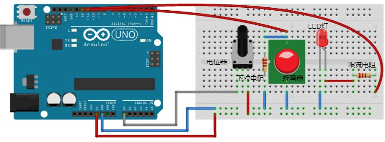
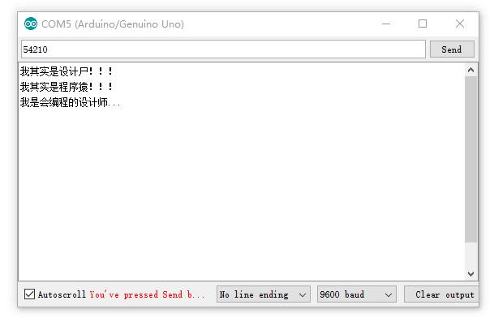
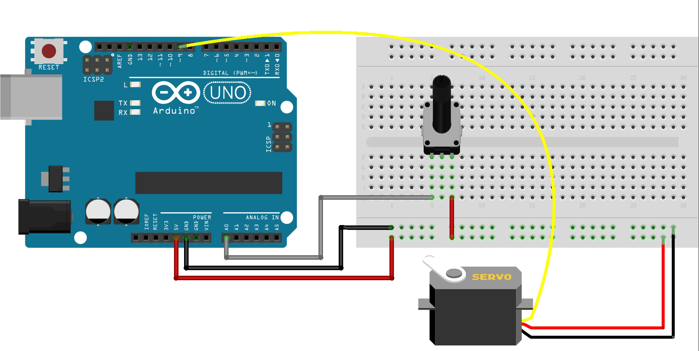
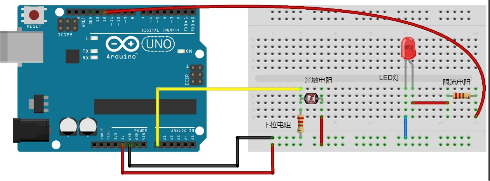

> 实验器材：Arduino UNO(1)，面包板(1)，电阻(10kΩ(1，下拉电阻)、100Ω(1，限流电阻))，LED灯(1)，电位器(1)；舵机(servo，1)；
# 04_C语言的逻辑判断与循环
## 关系运算符
| 运算符 | 说明 | 
| --- | --- | 
| > | 大于 |
| >= | 大于或等于 |
| < | 小于 |
| <= | 小于或等于 |
| == | 等于 |
| != | 不等于 |
关系运算符计算的结果位逻辑true(非0)或逻辑false(0)。
## if 语句
### if实验程序(电位器、蜂鸣器)
```C
/*
  Analog Input

  Demonstrates analog input by reading an analog sensor on analog pin 0 and
  turning on and off a light emitting diode(LED) connected to digital pin 13.
  The amount of time the LED will be on and off depends on the value obtained
  by analogRead().

  The circuit:
  - potentiometer
    center pin of the potentiometer to the analog input 0
    one side pin (either one) to ground
    the other side pin to +5V
  - LED
    anode (long leg) attached to digital output 13
    cathode (short leg) attached to ground

  - Note: because most Arduinos have a built-in LED attached to pin 13 on the
    board, the LED is optional.

  created by David Cuartielles
  modified 30 Aug 2011
  By Tom Igoe

  This example code is in the public domain.

  http://www.arduino.cc/en/Tutorial/AnalogInput
*/

int sensorPin = A0;    // select the input pin for the potentiometer
int ledPin = 12;      // select the pin for the LED
int sensorValue = 0;  // variable to store the value coming from the sensor
int buzzerPin=11;

void setup() {
  // declare the ledPin as an OUTPUT:
  Serial.begin(9600);
  pinMode(ledPin, OUTPUT);
  pinMode(buzzerPin,OUTPUT);
}

void loop() {
  // read the value from the sensor:
  sensorValue = analogRead(sensorPin);
  if (sensorValue>=512){
    digitalWrite(buzzerPin,HIGH);
  }else{
    digitalWrite(buzzerPin,LOW);
  }
  Serial.println(sensorValue);
  // turn the ledPin on
  digitalWrite(ledPin, HIGH);
  // stop the program for <sensorValue> milliseconds:
  delay(sensorValue);
  // turn the ledPin off:
  digitalWrite(ledPin, LOW);
  // stop the program for for <sensorValue> milliseconds:
  delay(sensorValue);
  
}
```
### 电路图(基于fritzing)


### if语法
`if (condition A){
...;
}
if (condition B){
...;
}else{
...;
}`

**实验中if语句**
```C
  if (sensorValue>=512){
    digitalWrite(buzzerPin,HIGH);
  }else{
    digitalWrite(buzzerPin,LOW);
  }
```
## switch语句
### switch实验程序(串口)
```C
//richieBao 2018-04-27
#define indicatorLED 12
int readLine(char str[]);
int indicatorLed=indicatorLED;

void setup() {
  Serial.begin(9600);
  pinMode(indicatorLed,OUTPUT);
}

void loop() {
  if (Serial.available()>0){    
    int counter;
    int readSD;
    char readSerialData[20];
    counter=readLine(readSerialData);    
   // Serial.print(counter);
    readSD=atoi(readSerialData);
    //Serial.print("read Serial Data is ");
    //Serial.println(readSD);
    switch(readSD){
      case 1:Serial.println("我其实是设计尸！！！");digitalWrite(indicatorLed,HIGH);delay(500);break;
      case 2:Serial.println("我其实是程序猿！！！");digitalWrite(indicatorLed,HIGH);delay(500);break;
      case 5421:Serial.println("我是会编程的设计师...");digitalWrite(indicatorLed,HIGH);delay(1000);break;
      //可以无限制下去
    }
  }else{
    digitalWrite(indicatorLed,LOW);
  }
}

int readLine(char str[]){
  char c;
  int index=0;  
  while (true){
    if (Serial.available()>0){
      c=Serial.read();      
      if(c!= '0'){
        str[index++]=c;   
        //Serial.print("ok");  //用于调试标识
      }else{
        str[index]='\0';        
        break;
      }
    }
  }
  return index;
}
```
执行结果：



### switch语法

```C
switch (expression){
  case 1:...;break;
  case 2:...;break;
  case 3:...;break;
  case 4:...;break;
  ...;
  default:break;
}
```
## C语言的预处理指令
编译器 会首先寻找实际编译之前需要处理的指令，这些指令就是“预处理指令(Preprocessor Directives)”，它们在实际编译前执行，例如上述实验中的`#define indicatorLED 12`，通过预处理指令，可以方便程序的修改，以及增强可读性。注意：预处理指令结尾无分号，并非语句。

**Arduino C的预处理指令**
| 指令 | 功能 | 
| --- | --- | 
| #define NAME value | 将NAME标识定义位value常量 | 
| #undef NAME | 将NAME从预定义常量列表中移除 | 
| #line lineNumberValue "filename.ino" | 使编译器引用filename.ino文件的第lineNumberValue行代码，该功能通常用于调试。Arduino C的参考资料中无此指令，但编译器可识别 | 
| #if definedConstant expression operand | 条件编译。例如`#if LED==12 #define VOLTS 5 #endif `| 
| #if defined NAME statement(s) #endif | 当NAME已经被定义时，编译中间的语句。Arduino C的参考资料中无此指令，但编译器可识别 | 
| #if !defined NAME statement(s) #endif | 与#if指令同，只是当 NAME未被定义时，编译中间的语句。Arduino C的参考资料中无此指令，但编译器可识别 | 
| #ifdef | 与#if指令同。NAME已经被定义时，编译中间的语句。Arduino C的参考资料中无此指令，但编译器可识别  | 
| #ifndef | 与#if !defined同。 Arduino C的参考资料中无此指令，但编译器可识别 | 
| #else | 与#if指令同，类似if-else语句，只不过是控制编译的过程。例如`#if defined ATMEGA2560 #define BUFFER 64 #else #define BUFFER 32 #endif `,Arduino C的参考资料中无此指令，但编译器可识别| 
| #elif | 与#if一起构成嵌套 | 
| #include "filename.xxx" | 打开名为filename.xxx的文件，将内容读入程序的源代码中。如果为双引号，将在当前活动目录中查找该文件；如果为< >尖括号，将通过实现定义(implementation-defined)的方式查找。例如：#include <SPI.h> | 

## C语言的循环
### for循环实验程序(舵机)
```C
/*
 Controlling a servo position using a potentiometer (variable resistor)
 by Michal Rinott <http://people.interaction-ivrea.it/m.rinott>

 modified on 8 Nov 2013
 by Scott Fitzgerald
 http://www.arduino.cc/en/Tutorial/Knob
modified on 28 Apr 2018
 by richieBao
*/

#include <Servo.h>

Servo myservo;  // create servo object to control a servo

int potpin = 0;  // analog pin used to connect the potentiometer
int val;    // variable to read the value from the analog pin
const int buttonPin = 2;
int buttonState=0;

void setup() {
  myservo.attach(9);  // attaches the servo on pin 9 to the servo object
  pinMode(buttonPin,INPUT);
}

void loop() {
  buttonState=digitalRead(buttonPin);
  if (buttonState==HIGH){
    for(int angle=0;angle<180;angle+=1){
      myservo.write(angle);
      delay(20);
    }
    for(int angle=180;angle>=1;angle-=1){
      myservo.write(angle);
      delay(20);      
    }
  }else{
      val = analogRead(potpin);            // reads the value of the potentiometer (value between 0 and 1023)
      val = map(val, 0, 1023, 0, 180);     // scale it to use it with the servo (value between 0 and 180)
      myservo.write(val);                  // sets the servo position according to the scaled value
      delay(15);                           // waits for the servo to get there
  }
}
```
### 电路图


### for语法
```C
for (初始化循环控制变量;执行逻辑检测;修改循环控制变量的状态){
...;
}
```
> 对很多传感器、执行机构、液晶屏、无线网络等各部分，一般都有现成的[库](https://www.arduino.cc/en/Reference/Libraries)使用，一定要先查找库，避免重复编写代码，造轮子，应优先选择代码复用。上述实验中对于舵机的控制，直接使用`#include <Servo.h>`，包含[https://www.arduino.cc/en/Reference/Servo](Servo.h库)，从而轻松控制舵机。

## while循环
### while循环语法
`while(expression){
...;
}`
例如在“switch实验程序(串口)”实验中，while(true)配合break语句跳出循环，可以思考将下述程序修改为while(true)配合continue语句(立即终止当前循环内容，回到条件测试expression)的形式：
```C
int readLine(char str[]){
  char c;
  int index=0;  
  while (true){
    if (Serial.available()>0){
      c=Serial.read();      
      if(c!= '0'){
        str[index++]=c;   
        //Serial.print("ok");  //用于调试标识
      }else{
        str[index]='\0';        
        break;
      }
    }
  }
  return index;
}
```
### while实验程序(光敏电阻)
```C
//richieBao 2018-04-28
const int ledPin=12;
const int LDR=A0;

void setup() {
  Serial.begin(9600);
  pinMode(ledPin,OUTPUT);
}

void loop() {
  int LDRValue=analogRead(LDR);
  Serial.println(LDRValue);
  while(LDRValue<200){
    digitalWrite(ledPin,HIGH);
    LDRValue=analogRead(LDR);
  }
  digitalWrite(ledPin,LOW);
}
```
### 电路图


> 注意，在while()循环中，如果要跳出循环，需要在循环内，修改循环控制的变量状态，即增加`LDRValue=analogRead(LDR);`语句。
