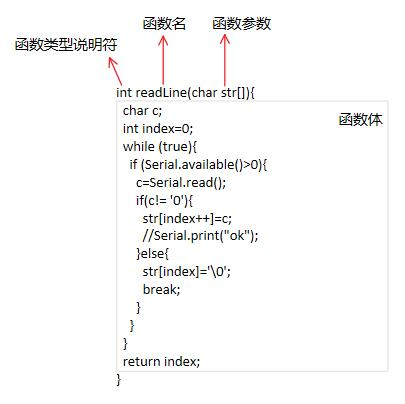
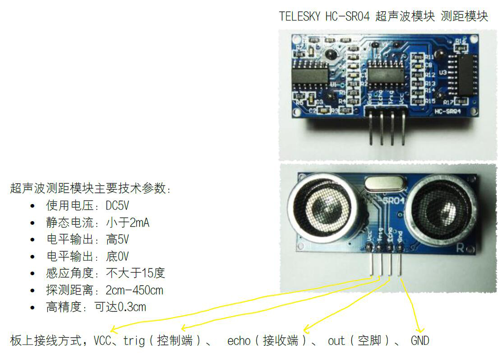
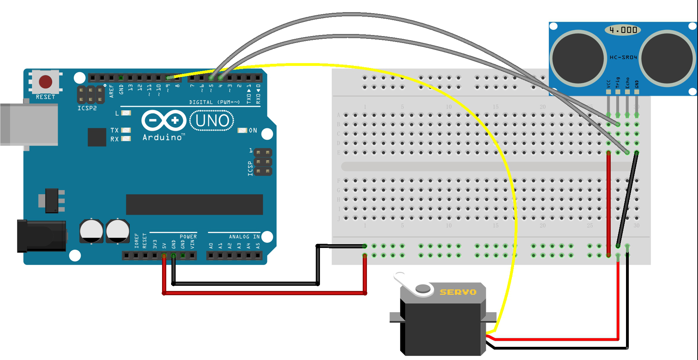

> 实验器材：Arduino UNO(1)，面包板(1)，舵机(servo，1)；HC-SR03超声波测距模块(1)
# 05_C语言函数与作用域和存储类型
大部分类型语言，基本函数都是其重要组成部分，同时函数库中已经编写好的的不计其数的函数，可以直接使用，从而快速搭建待解决问题的代码，实现相应的功能。C语言最初的设计思想是以最少的关键字实现一种轻便的语言，因此ANSI C只有32个关键字，而将许多标准的语言功能都放在了其标准库中实现。
## 函数的基本结构


**函数类型说明符：**
为调用函数返回值的类型，可以是任何类型。例如案例中，`return index;`返回的变量index的值为int类型。如果不返回任何值，则使用void关键字作为函数类型说明符。

**函数名**
函数遵循变量的命名规则，好的名字应该可以反应这个函数做什么，而非如何做。通常函数如同黑箱，只告诉该函数提供哪些功能，不会反应任何实现这些功能的细节。当函数名相同时，但是传入的函数参数不同，编译器会自动选择对应的函数。函数名和函数参数统称为函数签名。

**函数参数**
传入函数中，需要使用的参数，当未传入具体值时的参数变量为形参，而当传入具体值时则一般称为为实参。传入的变量同样需要确定数据类型，例如此例中`char str[]`为char类型的数组。

**函数体**
{ }中包括的所有内容。编写代码时，尽量使代码简洁，易读。

## 程序编写经验谈
1.  尽量用函数逐一解决每个“点”的问题
2. 一定要有关键注释，日子久了肯定会忘，回来借助注释能快速理解当时代码的用意
3. 变量名称要尽量体现其含义，增加代码易读性，常规为codeStandard或者code_standard等格式
4. 能用巧妙简介的算法，就避免冗长的代码
5. 不断用`Serial.print();`查看结果，分析和组织数据结构
6. 庞大的库，很难都记住，但是知道如何查找手册或利用网络信息即可
7. 一定要有自己的一个常用代码集，方便日后快速查询
8. 代码尽量具有通用性，方便移植
9. 函数尽可能被设计用于完成单一任务，避免冗余复杂。
10. 尽可能避免一个函数依赖于另一个函数的程度

## 函数实验(HC-SR03超声波测距模块)
### HC-SR03超声波测距模块


### 电路图


### 实验程序(HC-SR03)
```C
//richieBao 2018-04-28
#include <Servo.h>
const int TrigPin = 4; //SR04控制端
const int EchoPin = 5; //SR04接收端
float distance;
float disTemp=0;
Servo myservo;  

void setup(){
    Serial.begin(9600);
    myservo.attach(9);
    myservo.write(45);
    pinMode(TrigPin, OUTPUT); //设置SR04控制端为输出
    pinMode(EchoPin, INPUT); //设置SR04接收端为输入
    Serial.println("Ultrasonic sensor:"); //程序PC串口测试用
}

void loop() {    
    distance=sr04Distance(); 
    //使用pulseIn()函数读取脉冲时间长度时，如果  没有脉冲则返回0，因此需要对该种情况做出判断，当返回为0时，保持舵机角度不变。
    if (distance<1){
      disTemp=disTemp;
    }else{
      disTemp=distance;
    }
    if (disTemp <10 and disTemp>=0.1){
      int angleA=80;
      myservo.write(angleA);
    }
    if (disTemp>=10){
      int angleB=10;
      myservo.write(angleB);
    }
    Serial.print(distance);
    Serial.print(" cm");
    Serial.println();
    delay(1000);    
}

float sr04Distance(){
    float distance; //测量距离变量
    digitalWrite(TrigPin, LOW); //SR04控制端输出低电平
    delayMicroseconds(2); //延时
    digitalWrite(TrigPin, HIGH); //SR04控制端输出高电平
    delayMicroseconds(10); //根据超声波测距模块说明延时10微秒
    digitalWrite(TrigPin, LOW); //SR04控制端输出低电平
    distance = pulseIn(EchoPin, HIGH) / 58.00; //使用pluseIn()检测脉冲宽度，并计算距离，可以根据实际测量值，调整计算公式除数
    return distance;
}

```
函数float sr04Distance()根据HC-SR03超声波测距模块的手册说明，对TrigPin设置高低电平的变化，从而从EchoPin端使用[pulseIn()函数](https://www.arduino.cc/reference/en/language/functions/advanced-io/pulsein/)读取。

### 逻辑运算符
在上述实验中`disTemp <10 and disTemp>=0.1`语句使用了逻辑与and(&&)，逻辑运算符：
| 类型 | 含义 | 举例 | 描述(二进制) |
| --- | --- | --- | --- |
| && | 逻辑与(AND) | x && y | 只有都为1时才为1 |
| || | 逻辑或(OR) | x || y | 只有都为0时才为0 |
| ！ | 逻辑非(NOT) | !x | 1时为0，0时为1 |

##  作用域和存储类型
### 作用域
作用域为数据对象在程序中的可见性和生命周期。通常可以分为语句块作用域、本地作用域和全局作用域。
| 作用域 | 含义 | 举例 |
| --- | --- | --- |
| 语句块作用域 | 数据只存在于当前语句块的定义点至结束点的范围内 |    ` if (disTemp <10 and disTemp>=0.1){int angleA=80; myservo.write(angleA);} `|
| 本地作用域 | 数据存在于从定义点开始，至整个函数结束的地方 | `float sr04Distance(){ float distance; digitalWrite(TrigPin, LOW); delayMicroseconds(2);digitalWrite(TrigPin, HIGH); delayMicroseconds(10); digitalWrite(TrigPin, LOW); distance = pulseIn(EchoPin, HIGH) / 58.00;  return distance;} `|
| 全局作用域 | 能够被程序中的所有函数访问。一般在函数之外的地方定义。 | `float distance;float disTemp=0;` |

>可以通过(&)取址运算符获取变量地址，从而进一步证实不同作用域的变量地址情况。

### 存储类型
Arduino C 可以识别4中存储类型(保留字)：auto、register、static和extern。

#### auto存储类型
本地作用域下默认的变量存储类型，通常不需要显式的使用，处了强调语义，无任何意义。

#### register存储类型
register存储类型告知编译器当前变量存储于芯片的寄存器(register)中，可以优化代码的执行效率。

#### static存储类型
每次函数调用时，都会创建一组新的本地变量，意味着上次执行该函数所产生的本地变量的值丢失。一种解决方法时将其修改为全局变量，也可以使用static存储类型。例如在函数中声明`static int val=0;return ++val;`中，声明的val变量不会在每次调用函数时执行。可以通过串口打印该值，来查看变化情况。

#### extern存储类型
当建立了多个程序文件时，如果其中一个程序文件需要另一程序文件的变量，则需使用extern存储类型。例如`extern int val;`，虽然该程序文件中未定义val变量，但创建了属性列表，从而可以使用在其它程序文件中所定义的val变量。此时需要注意使用#include "filename.xxx"C语言的预处理指令。

> volatile关键字，是一个变量修饰符，例如`volatile int lastTestValue; `告诉编译器当每次引用这个变量时，都需要从内存中载入。多数情况下，当使用变量时，其rvalue已经存在于寄存器中，无需重新从内存中载入。但有时内存中的值可能没有与寄存器中的值同步，需要使用volatile修饰符，编译器会在程序使用这个变量时重新获取其rvalue值，避免不同步的情况。


