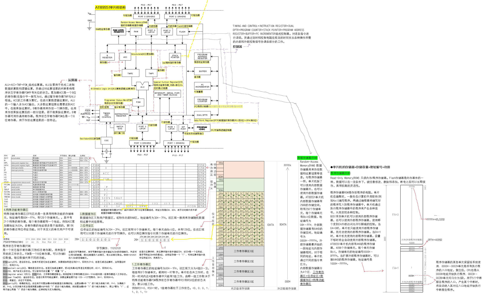
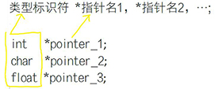
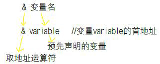
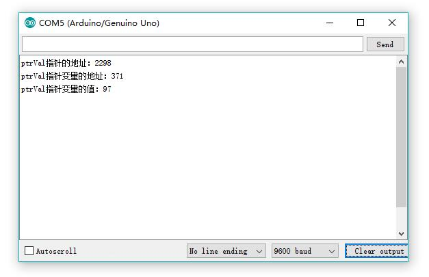
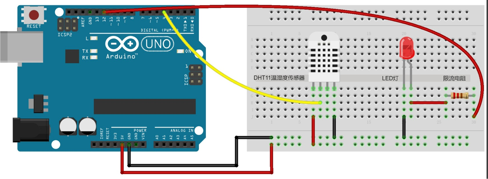
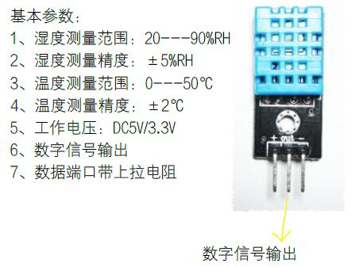

> 实验器材：Arduino UNO(1)，面包板(1)，电阻(100Ω(1，限流电阻))，LED灯(1)，DHT11温湿度传感器(1)
# 06_指针_A_基本概念
访问和修改变量的途径，一种是直接访问和修改这块区域的内容；另外先求出变量的地址，通过地址对该变量的值进行访问，即指针和指针变量。指针是变量在计算机或单片机内所占有存储区域的地址。利用指针变量可以操作各种基本的数据类型和数组等复合数据结构，使C语言具有处理单片机内存地址的能力。指针是C语言中最重要的一环，正确的理解和使用指针是掌握C语言的重要标志。
## 基本概念
存储器中有很多存储单元，为了查找方便，需要给每个单元赋予不同的编号，就是地址编号，即地址。通常一个字节8位称为一个存储单元。当为存储单元逐个编号后，就可以根据其地址编号准确找到该存储单元及其存储的数据。

**以51单片机为例**


### 指针
实际上也是一个地址，为变量在存储单元中的首地址。单片机中的数据都存储于数据存储器RAM和程序存储器ROM中，不同的数据类型所占用的存储单元数与其大小有关。根据数据类型或数据结构的不同，一个变量往往占有一组连续的存储单元，因此引入指针的概念，指向一个数据结构的首地址，使得概念更明确，寻址更方便。
### 指针变量
是用来存放指针的一种变量类型。一个指针变量的值就是某个存储单元的地址。程序中定义指针的目的就是通过指针访问存储单元。通过指针变量可以访问变量的地址及其它数据结构的地址，如数组、函数的首地址等。因为数组或函数都是连续存储于存储器单元中，通过访问指针变量取得数组或函数的首地址，就找到了该数组或函数。因此在程序中出现数组和函数的地方，用一个指针变量来表示和读写，使得程序精炼与高效。
### 指针变量的声明


**类型标识符**，表示指针变量所指向变量的类型，即指针变量的类型。例如指针变量指向的变量类型为int类型，则指针类型为int类型

*，星号用于告诉编译器这是个指针变量。

> 通常指针名可以以ptr开头，例如ptrName

### 指针变量的赋值
* 指针变量声明后可以指向任何同类型的变量。如果定义指针变量时不对其初始化，系统则不能确定其具体的指向，此时该指针变量被初始化为NULL，值为0，为空指针。
* 未经赋值的指针变量不能在程序中使用，否则指针将指向错误导致程序混乱。
* 指针变量的赋值只能赋予地址，而不能被赋予任何其它数据，例如数值3.14。
* 程序员并不知道变量的具体地址，变量的首地址是由编译系统分配的，为此可以使用地址运算符"&"，获取变量的首地址，形式为：& 变量名



**初始化赋值**
`int variable;  //定义整型变量variable
int *pointer=& variable;  //将整型变量variable的首地址& variable赋值给指针变量pointer`

```C
//richieBao 2018-04-28
int variable;

void setup() {
  Serial.begin(9600);
}

void loop() {
  variable=97;
  int *ptrVal=& variable;
  Serial.print("ptrVal指针的地址：");
  Serial.println((long) &ptrVal,DEC);
  Serial.print("ptrVal指针变量的地址：");
  Serial.println((long) ptrVal,DEC);
  Serial.print("ptrVal指针变量的值：");
  Serial.println(*ptrVal);
  delay(2000);
}
```
串口结果为：



**取地址赋值**  基本同“初始化赋值”，仅先定义指针变量，后赋值。
```C
int varialbe;  //定义整型变量variable
int *pointer;  //定义指针变量pointer
pointer=& variable;  //将整型变量variable的首地址& variable赋值给已定义的指针变量pointer
```
**指针之间赋值**
```C
int var_1=12,var_2=16;  //定义整型变量var_1和var_2，并初始化
int *pt_1=var_1,*pt_2=var_2;  //定义整型指针变量pt_1和pt_2，并初始化
pt_2=pt_1;  //将指针变量pt_1，即变量var_1的首地址赋予指针变量pt_2
*pt_2=*pt_1;  //*pt_1代表变量var_1的值(数据)，将该值送给指针变量pt_2所指示的地址，即*pt_2为指针pt_2地址的数据
```
注意上述语句之间的关系。同时需要注意指针之间赋值需要各个指针变量具有相同的类型，例如pt_1和pt_2均为整型。可以自行通过串口打印查看结果。

**数组赋值**
```C
int array[12],*pt;  //声明数组array和指针变量pt
pt=array;  //将数组名array，即表示数组的首地址，赋予指针变量pt
```
> 数组名表示数组的首地址，即为数组第一个元素的地址，因此array等同于array[0]，即`pt=array[0];`

`int array[12],*pt=array;  //初始化赋值方式`

**字符串赋值**
```C
char *pt;  //声明字符型指针变量
pt="Hello C!";  //将字符串赋予指针变量pt
char *pt="Hi ! C";  //初始化赋值
```
> 注：字符串赋值给指针变量，是将存放字符串的字符数组首地址传入指针变量

**函数入口赋值**
```C
int (*pt_fun)();  //声明指针变量pt_fun
pt_fun=function;  //将定义的函数function的入口地址赋予指向函数的指针变量
```

### 取址(地址)运算符&与取值(内容)运算符*
**取值运算符***:用来表示指针变量所指向内存中的数据内容。其为单目运算符，符合自右至左的结合性。形式为：* 指针变量名，*之后必需为指针变量。即获得指针变量所指向单片机存储单元地址中的数据。
> 注意：int val=12, *pt=val;指针变量声明中的"*"为类型说明符，表示其后 是指针类型的变量；而y=*pt+x；表达式中的“*”则是一个运算符，用来表示指针变量pt所指向地址的数据值。

**取址运算符“&”**:用于取变量的地址。其为单目运算符，符合自右至左的结合性。形式为：& 变量名，变量名为所要取址的变量。即获得变量在单片机中实际存储单元的地址。

## 指针实验-A
### 代码
```C
//richieBao 2018-04-28

int var_c=2,var_d=5,*pt_b,*pt_c;  //声明整型变量var_c、var_d和指针变量pt_b、pt_c
int var_a=12,var_b,*pt_a=&var_a;  //声明整型变量var_a、var_b，声明指针变量pt_a并初始化为var_a变量的首地址
int n=0;
 
void setup() {
  Serial.begin(9600);
}

void loop() {  
  while(n<1){
      var_b=*pt_a-6;  //指针变量pt_a所指地址数据(数值)-6=var_a-6=12-6=6
      Serial.print("var_b=");
      Serial.println(var_b);
      var_b=++*pt_a;  //指针变量pt_a所指地址数据自加，"++"放于前为加后再赋值予变量var_b
      Serial.print("var_b=");
      Serial.println(var_b);
      var_b=*pt_a++;  //指针变量pt_a所指地址数据自加，"++"放于后为自加前就赋值予变量var_b(?)
      Serial.print("var_b=");
      Serial.println(var_b); 
      
      pt_b=&var_c;  //取地址赋值，即将变量var_c的首地址赋予指针变量pt_b
      pt_c=&var_d;  //取地址赋值，即将变量var_d的首地址赋予指针变量pt_c
      Serial.print("Befor:\nvar_c/nvar_d=");
      Serial.println(var_c);
      Serial.println(var_d);
      *pt_b=*pt_c;  //将指针变量pt_c所指地址数据赋予指针变量pt_b所指存储单元地址
      Serial.print("var_c/var_d=");
      Serial.println(var_c);
      Serial.println(var_d);   
      pt_b=pt_c;  //将指针变量pt_c即地址赋予指针变量pt_b
      Serial.print("After:\nvar_c/var_d/*pt_b/*pt_c/pt_b/pt_c=");
      Serial.println(var_c);
      Serial.println(var_d);     
      Serial.println(*pt_b);
      Serial.println(*pt_c);   
      Serial.println((long) pt_b);
      Serial.println((long) pt_c);
      Serial.print(*pt_b);
      Serial.print(*pt_c); 
      n++;
  } 
}
```

### 运行结果
```
var_b=6
var_b=13
var_b=13
Befor:
var_c/nvar_d=2
5
var_c/var_d=5
5
After:
var_c/var_d/*pt_b/*pt_c/pt_b/pt_c=5
5
5
5
258
258
55
```
> *pt_c为取指针变量pt_c所指存储单元地址数据，赋值变化*pt_b即指针变量pt_b所指存储单元地址数据，从而改变var_c变量的值，因为var_c变量存储单元地址同指针变量pt_b所指存储单元地址

## 指针实验-B(修改函数传入参数的值/DHT11)
### 电路图


**DHT11温湿度传感器**



### 代码
```C
// DHT Temperature & Humidity Sensor
// Unified Sensor Library Example
// Written by Tony DiCola for Adafruit Industries
// modified on 28 Apr 2018 by richieBao
// Released under an MIT license.
// Depends on the following Arduino libraries:
// -Adafruit Unified Sensor Library: https://github.com/adafruit/Adafruit_Sensor
// -DHT Sensor Library: https://github.com/adafruit/DHT-sensor-library
#include <Adafruit_Sensor.h>
#include <DHT.h>
#include <DHT_U.h>
#define DHTPIN 4 //定义DHT传感器引脚
#define LED 12 //定义LED指示灯引脚
//选择DHT类型，本次实验使用的为DHT11:
#define DHTTYPE DHT11 // DHT 11
//#define DHTTYPE DHT22 // DHT 22 (AM2302)
//#define DHTTYPE DHT21 // DHT 21 (AM2301)
// 可以下载手册，查看细节:https://learn.adafruit.com/dht/overview
DHT_Unified dht(DHTPIN, DHTTYPE); //根据指定的DHTPIN和DHTTYPE实例化
uint32_t delayMS;

#define highestTemp 20
#define lowestTemp 20
#define amountStorage 5
float temps[amountStorage];
int i=0;
int counter;

int calculateMinMax(float temps[],int *minTemp,int *maxTemp);

void setup() {  
  Serial.begin(9600);
  //设备初始化
  dht.begin();
  pinMode(LED, OUTPUT); //LED指示灯引脚定义为输出
  pinMode(DHTPIN,INPUT); //DHT11信号引脚定义为输入
  Serial.println("DHTxx Unified Sensor Example");
  //打印温度传感器细节
  sensor_t sensor;
  dht.temperature().getSensor(&sensor);
  Serial.println("------------------------------------");
  Serial.println("Temperature");
  Serial.print ("Sensor: "); Serial.println(sensor.name);
  Serial.print ("Driver Ver: "); Serial.println(sensor.version);
  Serial.print ("Unique ID: "); Serial.println(sensor.sensor_id);
  Serial.print ("Max Value: "); Serial.print(sensor.max_value); Serial.println(" *C");
  Serial.print ("Min Value: "); Serial.print(sensor.min_value); Serial.println(" *C");
  Serial.print ("Resolution: "); Serial.print(sensor.resolution); Serial.println(" *C");
  Serial.println("------------------------------------");
  //打印湿度传感器细节
  dht.humidity().getSensor(&sensor);
  Serial.println("------------------------------------");
  Serial.println("Humidity");
  Serial.print ("Sensor: "); Serial.println(sensor.name);
  Serial.print ("Driver Ver: "); Serial.println(sensor.version);
  Serial.print ("Unique ID: "); Serial.println(sensor.sensor_id);
  Serial.print ("Max Value: "); Serial.print(sensor.max_value); Serial.println("%");
  Serial.print ("Min Value: "); Serial.print(sensor.min_value); Serial.println("%");
  Serial.print ("Resolution: "); Serial.print(sensor.resolution); Serial.println("%");
  Serial.println("------------------------------------");
  //根据传感器参数设置传感器读取延时
  delayMS = sensor.min_delay / 1000;
}

void loop() {
  int lowTemp;
  int hiTemp;
  //延时
  delay(delayMS);
  //读取温度数据并串口打印
  sensors_event_t event;
  dht.temperature().getEvent(&event);
  if (isnan(event.temperature)) {
    Serial.println("Error reading temperature!");
  }
  else {
    Serial.print("Temperature: ");
    Serial.print(event.temperature);
    Serial.println(" *C");
    if (i<amountStorage){
     Serial.print("++++++++++++++++++++++");
     Serial.println(i);
     temps[i++]=event.temperature;
    }else{     
      Serial.println("######################");
      counter=calculateMinMax(temps,&lowTemp,&hiTemp);
      Serial.print("lowTemp：");
      Serial.println((long) lowTemp,DEC);
      Serial.print("hiTemp：");
      Serial.println((long) hiTemp,DEC);   
      i=0;   
    }
}
  //读取湿度数据并串口打印
  dht.humidity().getEvent(&event);
  if (isnan(event.relative_humidity)) {
    Serial.println("Error reading humidity!");
  }
  else {
    Serial.print("Humidity: ");
    Serial.print(event.relative_humidity);
    Serial.println("%");
  }
  digitalWrite(LED, LOW);
  delay(1000);
  digitalWrite(LED, HIGH);
  delay(2000);  
}

int calculateMinMax(float temps[],int *minTemp,int *maxTemp){
  int j;
  *minTemp=lowestTemp;
  *maxTemp=highestTemp;
  for (j=0;j<amountStorage;j++){
    if (temps[j]>=*maxTemp){
      *maxTemp=temps[j];
    }
    if (temps[j]<=*minTemp){
      *minTemp=temps[j];
    }    
  }
  return j;
}
```
> 注意自定义int calculateMinMax(float temps[],int *minTemp,int *maxTemp) 函数，float temps[]参数为浮点型数组，实参temps记录了给定数量的温度值。int *minTemp和int *maxTemp为指针，传入一个地址，因此传入的实参为&lowTemp和&hiTemp，即lvalue，为两个变量在内存中的存储地址。
